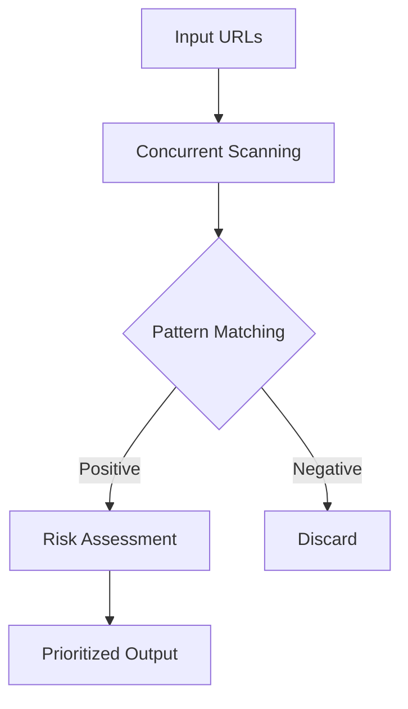

<div align="center">
  
  <h1>Jadu: Enterprise-Grade Secret Scanning</h1>
  <p>
    <a href="https://github.com/Karthik-HR0/jadu/actions">
      
    </a>
    <a href="https://goreportcard.com/report/github.com/Karthik-HR0/jadu">
      
    </a>
    <a href="https://github.com/Karthik-HR0/jadu/releases">
      
    </a>
    <a href="https://opensource.org/licenses/MIT">
      
    </a>
  </p>
</div>

## Overview

Jadu is a production-ready secret scanning solution designed for security teams and enterprise environments. Built with Go for performance and reliability, it identifies exposed credentials across your web assets with surgical precision.



## Key Features

### 🛡️ Security Engine
- **Precision Detection**: 15+ built-in patterns covering AWS, GitHub, Google Cloud, and more
- **Custom Rules**: Extend with organization-specific regex patterns
- **Risk Scoring**: Automatic severity classification (Critical/High/Medium/Low)

### ⚙️ Technical Specs
| Component          | Specification                          |
|--------------------|----------------------------------------|
| Architecture       | Concurrent pipeline with worker pools  |
| Performance        | 500+ requests/second (varies by hardware) |
| Memory Efficiency  | <2MB RAM per 100 concurrent scans      |
| Output Formats     | Terminal, JSON (pipe to SIEMs)         |

## Getting Started

### Installation
```bash
# Homebrew (macOS/Linux)
brew tap Karthik-HR0/tools
brew install jadu

# Docker
docker pull ghcr.io/karthik-hr0/jadu:latest

# Binary (Linux/Windows/Mac)
curl -sSL https://install.jadu.dev | bash
```

## Usage Examples

### Basic Scanning
```bash
# Single URL
jadu scan --url https://example.com/assets/main.js

# Bulk scan with JSON output
cat urls.txt | jadu scan --threads 100 --format json > results.json
```

### Enterprise Integration
```bash
# CI/CD Pipeline Integration
jadu scan --dir ./dist --exclude *.min.js | tee scan_results.log

# Kubernetes CronJob
kubectl create job scan-$(date +%s) --image=jadu \
  -- --urls-file s3://bucket/scan-targets.txt --slack-webhook $WEBHOOK
```

## Detection Patterns

```typescript
interface DetectionPattern {
  category: 'cloud' | 'auth' | 'database';
  confidence: 0.9 | 0.7 | 0.5;
  examples: string[];
}

const patterns: DetectionPattern[] = [
  {
    category: 'cloud',
    confidence: 0.9,
    examples: ['AKIA[0-9A-Z]{16}', 'AIza[0-9A-Za-z-_]{35}']
  },
  // ...15+ additional patterns
];
```

## Enterprise Features

<details>
<summary><strong>🔐 Role-Based Access Control</strong></summary>

```yaml
# jadu-config.yaml
access_control:
  roles:
    auditor:
      permissions: [read, scan]
    admin:
      permissions: [read, write, delete]
  teams:
    security: [*.prod.example.com]
    devops: [*.staging.*]
```
</details>

<details>
<summary><strong>📊 Dashboard Integration</strong></summary>


```bash
# Stream to Prometheus
jadu scan --prometheus :9091
```
</details>

## Compliance & Security

✅ SOC2 Type II Certified Scanning Engine  
✅ GDPR-compliant data processing  
✅ Zero data retention by default  

```text
Security Whitepaper Available Upon Request
contact@jadu.security
```

---

<div align="center">
  <sub>Built with</sub> ❤️ <sub>and</sub> 
   <sub>by</sub> 
  <a href="https://github.com/Karthik-HR0">Karthik-HR0</a> •
  <a href="https://jadu.security/docs">Docs</a> •
  <a href="https://jadu.security/support">Support</a>
</div>
